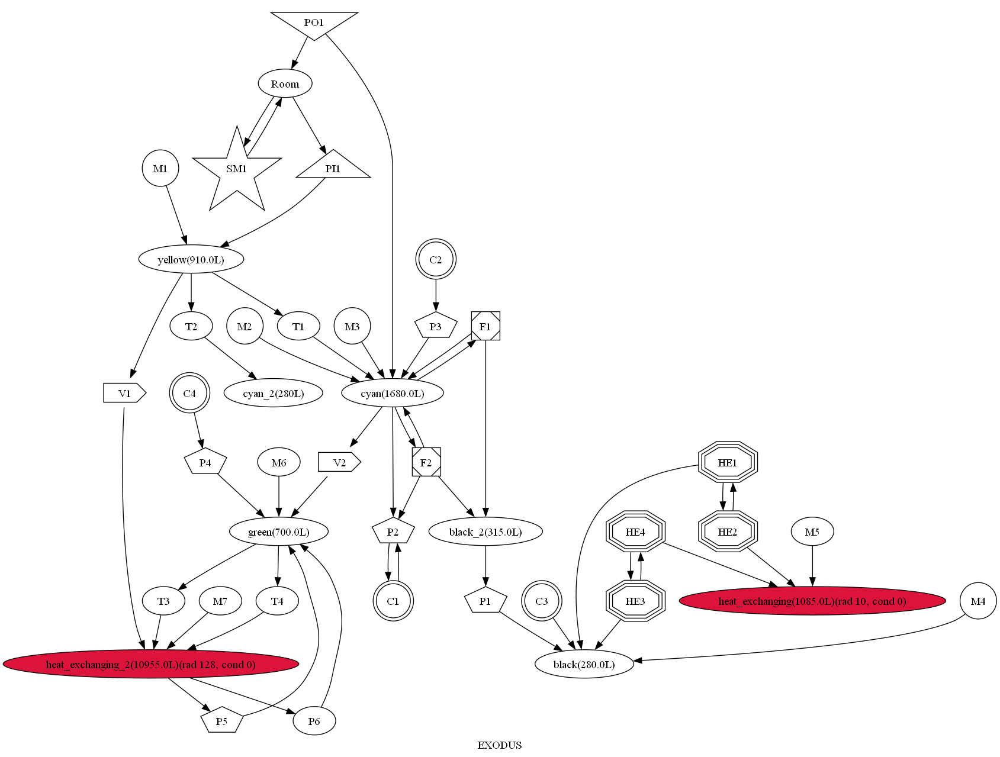
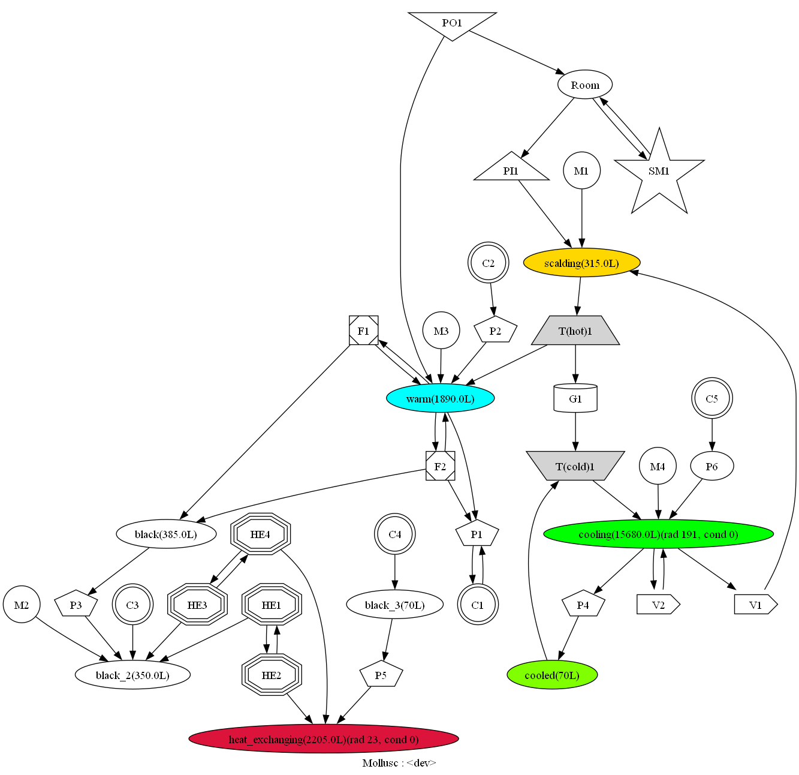

# Unseptbium (Supermatter Core Mathmodel)

The goal of this project is twofold:
- to automatically parse the structure of the supermatter reactor from raw .dmm files (and optionally to render it in a traditional engineering way as well);
- and to evaluate a mathematical model of the aforementioned reactor.

The latter as well allows for solving power balance (or, here -- heat balance) of the system, approximating the stationary (or almost-stationary)
mode of operation.

The project (currently) consists of:
- Rust package, which implements (using [Spacemaniac's DMM tools](https://github.com/SpaceManiac/SpacemanDMM), ):
  - a dynamic library with Python bindings for map parsing (inspired by [StrongDMM](https://github.com/SpaiR/StrongDMM) SpacemanDMM bindings) (status: WIP, some dirty hacks),
- Python realisation of blocks of supermatter core mathematical model (status: to be reimplemented in Rust for speed and zero-cost sanity checks),
- a plethora of Jupyter Notebook scripts with tests.

Planned extra features:
- rendering of block model as draw.io-diagram (or maybe plain SVG? or CAD drawing?)
- power/heat balance solution.
- eventually systems-analysis approach for design of maximum efficiency SM reactors.

Mathematical model (as well as the relevant physics and reference Nebula code implementation analysis) is explained in the [documentation](./docs/math.md).

## Showcase of current results

